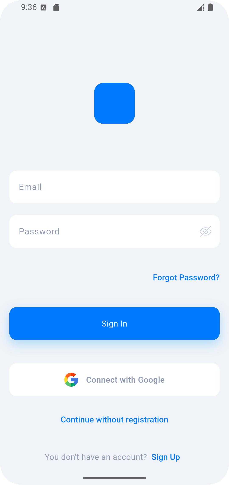
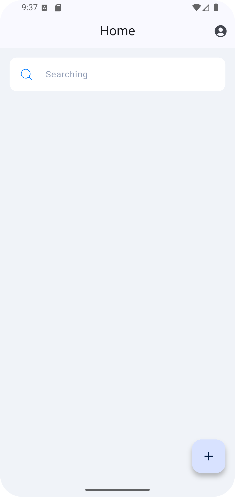
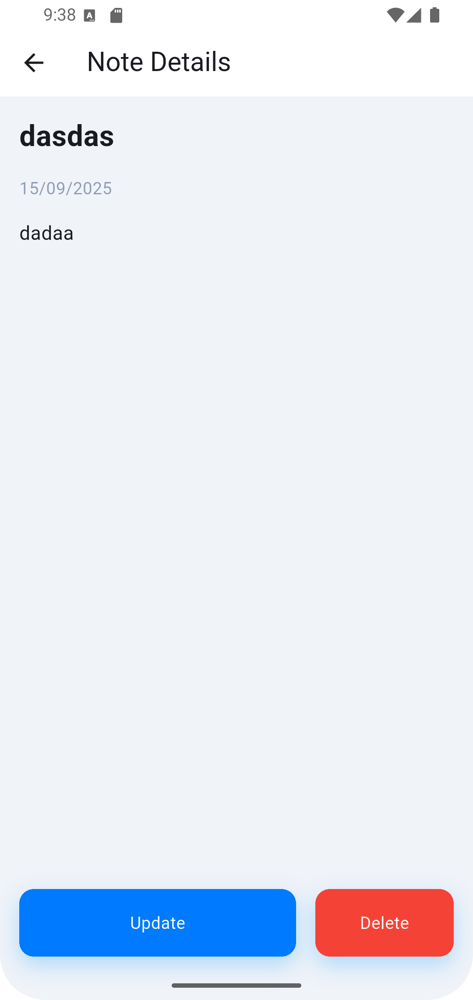
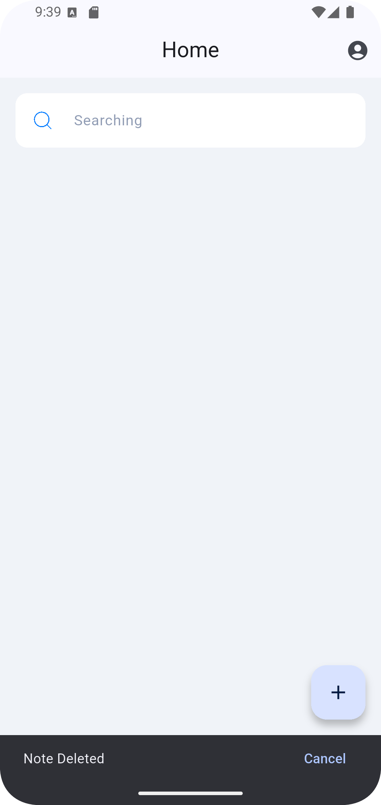

# Connectinno - Flutter Not Alma Uygulaması

## 🎯 Proje Hakkında
Bu proje, Flutter ile geliştirilmiş ve Firebase/Supabase backend ile entegre edilmiş bir not alma uygulamasıdır.  
Uygulama, çevrimdışı önbellekleme, global durum yönetimi ve kullanıcı dostu arayüz ile geliştirilmiştir.

---

## 📝 Özellikler

### Kimlik Doğrulama
- Kullanıcı kayıt olabilir, giriş yapabilir ve çıkış yapabilir.
- Firebase Authentication ile güvenli giriş sağlanır.

### Not Yönetimi (CRUD)
- Not oluşturma, okuma, güncelleme ve silme.
- Silinen notlar için `Undo` (geri alma) özelliği.

### Notları Sabitleme / Favorilere Ekleme
- Notlar listede sabitlenebilir ve en üstte gösterilir.

### Arama & Filtreleme
- Başlığa veya içeriğe göre notları filtreleme.
- Hem çevrimdışı hem de backend verilerinde hızlı sorgulama.

### Durum Yönetimi
- Bloc/Cubit kullanılarak global durum yönetimi sağlanmıştır.

### Çevrimdışı Öncelikli Davranış
- Notlar çevrimdışı erişilebilir.
- Ağ mevcut olduğunda backend ile otomatik senkronizasyon.

### UI & UX
- Basit ve sezgisel arayüz.
- Yükleme durumları ve hata yönetimi.

---

## 📸 Ekran Görüntüleri

  
*Kayıt ve giriş ekranı*

  
*Not listesi ve arama / filtreleme*

  
*Not detay ve düzenleme ekranı*

  
*Silinen not için geri alma (Undo)*

  
*Sabitlenmiş notlar listesi*

---

## ⚡ Kurulum ve Çalıştırma

```bash
# Repo klonla
git clone https://github.com/ckaradol/Connectinno---Flutter-Geli-tirici-Vaka-al-mas-
cd connectinno_flutter

# Bağımlılıkları yükle
flutter pub get

# Uygulamayı çalıştır
flutter run
